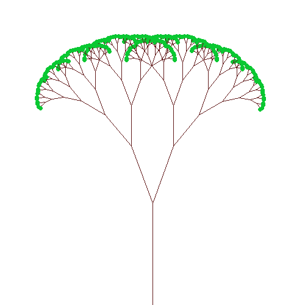

# C++ Utils

Libraries for student C++ code.

## Graphics

graphics/image.h can be used to create, view, load and save images. Example:



### TODOs:
1. Set up continuous integration testing of image_unittest
2. Update this README with some instructions and a link to documentation for graphics.

## Usage (for project creators):

To use this as a submodule in another lab or project, run:

```
git submodule add -b v1 https://github.com/ILXL/cpputils
```

This will create a .gitmodules file which you can add and commit, pointed at a particular
branch (in this case v1).

Then make sure everyone who checks out the repo gets the updates, for example adding this
command to your project Makefile to check if image.h is available:

```
cpputils/graphics/image.h:
	@git submodule update --init --recursive
```
