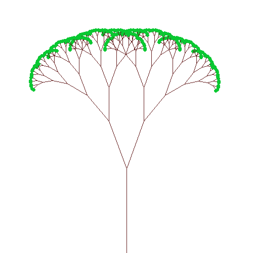

# C++ Utils

Libraries for student C++ code.

## Graphics


graphics/image.h can be used to create, view, load and save images. Example:



### Usage

[image.h](graphics/image.h) provides a ``Color`` class and an ``Image`` class. Images can
be loaded from file or created. Users may access and set per-pixel color data. Image can be modified
by manipulating them at the pixel level, as well as by drawing lines, circles, rectangles and text.
Images can be displayed and saved as bitmaps (an uncompressed format).

[image_event.h](graphics/image_event.h) provides a ``MouseEvent`` and a ``MouseEventListener`` interface. Extend the ``MouseEventListener`` interface and implement ``OnMouseEvent``. To begin receiving mouse events, use  ``Image::AddMouseEventListener`` to register for mouse events, and enter the event loop with ``Image::ShowUntilClosed``. Note you will need to use ``Image::Flush`` (and ``cout::flush``) to ensure updates are noted after calling ``Image::ShowUntilClosed``.

### Development

image.cc is backed by [CImg](cimg.eu), an open-source C++ image processing library. To update CImg.h
to the latest, run ``make update_cimg`` in graphics/.

It would be possible to back image.cc with some other implementation, for example Skia or OpenGL.
CImg was chosen because it is relatively light-weight, as all the implementation is contained within
the CImg.h header.

## cpputils usage (for lab and project creators):

To use this as a submodule in another lab or project, run:

```
git submodule add -b v1 https://github.com/ILXL/cpputils
```

This will create a .gitmodules file which you can add and commit, pointed at a particular
branch (in this case v1).

Then make sure everyone who checks out the repo gets the submodule, for example adding this
command to your project Makefile to check if image.h is available:

```
cpputils/graphics/image.h:
	@git submodule update --init --recursive
```

This checks out cpputils at a particular commit, and everyone cloning your git repository will
get that exact commit. This is useful for versioning: it ensures everyone using that git repository
will have the same version of cpputils until it is explicitly updated.

So, if you want to update the commit which cpputils is pointed at in an existing repo, you can pull
from within the cpputils directory and then cd back out to add and commit the change. For example,
this snippet pulls the latest from the v1 branch:

```
cd cpputils
git checkout v1 && git pull
cd ..
git add cpputils/ && git commit -m "Updating cpputils"
```

## Release process (for cpputils library contributors):

### Branches

Users of cpputils will check out a particular branch as a submodule within their repository. We
have created branches for each version to make it easy for submodules to get a known stable
cpputils.
* Development of cpputils should be merged to the master branch.
* Significant changes, once ready for usage, should be forked to new version branches (v1, v2, etc).
* Changes should not be merged back to earlier version branches, except bugfixes.

### Testing

Utility classes in cpputils should be tested to ensure changes do not cause any surprising
breakages. You can set up github continuous integration testing using
[Github Actions](https://github.com/features/actions).

You can add new tests by editing .github/workflows/c-cpp.yml. For example, the graphics class is
tested with graphcis/image_unittest.cc. c-cpp.yml has a workflow to ``make image_unittest``
which ensures all dependencies are installed (like gtest) and then builds and runs
image_unittest.cc.

You can see the result of each test pass in the [actions](https://github.com/ILXL/cpputils/actions)
tab on GitHub.

*Note: Github Actions is free for public repositories, but there are a limited number of minutes
for private repos! cpputils is public so it has unlimited actions minutes.*
