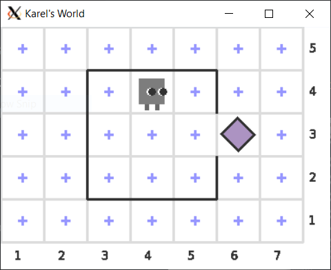

# C++ Utils

Libraries for student C++ code available under the MIT license.

## Graphics: Image library

``graphics/image.h`` can be used to create, view, load and save images. Example:

``graphics/image_event.h`` allows for interactive graphical programs with animation and mouse event handling.

### Usage

Learn more about how to use the C++ Utils graphics class in this [interactive tutorial](https://lab.cs50.io/ILXL-guides/intro-to-graphics).

## Karel the Robot in C++

Karel the Robot is a gentle introductory programming language created by [Dr. Richard Pattis](https://www.ics.uci.edu/~pattis/) in [*Karel the Robot: A Gentle Introduction to The Art of Programming*](https://www.google.com/books/edition/_/ghcZAQAAIAAJ?hl=en&gbpv=1). The Karel language emphasizes logic while hiding tricky syntax, allowing anyone to begin making exciting graphical programs with very little background.

### Accessibility

Karel programs may export the world to CSV after each action. This may be helpful to screen-reader users.

Karel programs may prompt before each robot action. This may be helpful for users who need to control the speed of execution.

### Usage

To create Karel the Robot programs in C++, include ``karel/karel.h``.

(TODO): Learn more about how to use the C++ Utils Karel the Robot functions in this [interactive tutorial](https://github.com/ILXL-guides/intro-to-karel)

## For developers and instructors

Read more about developing and including C++ Utils in the [wiki](https://github.com/ILXL/cpputils/wiki).
